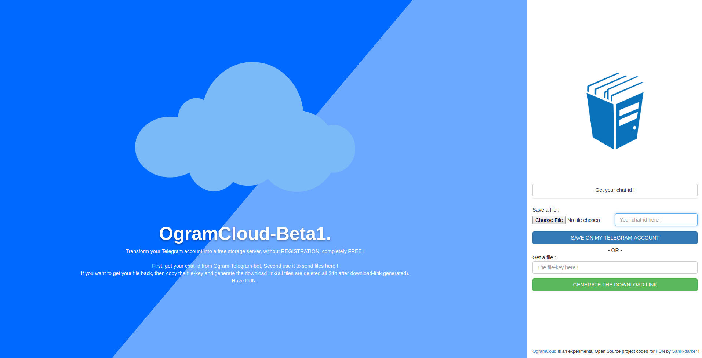
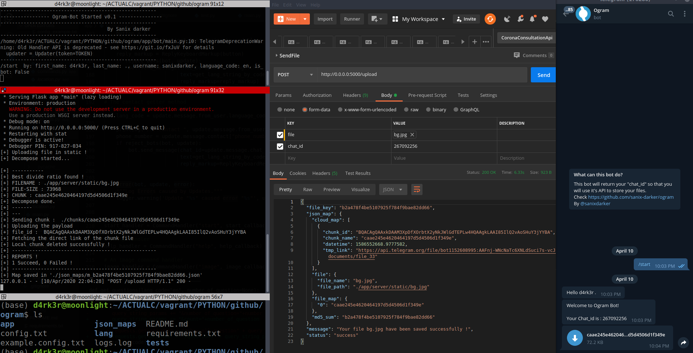

<p align="center">
  

  <h1>OgramCloud</h1>
  A Tricky-Hack to use Telegram-servers as free "FREE-STORAGE-API" !
  <table>
      <tr>
         <td></td>
      </tr>
      <tr>
         <td></td>
      </tr>
  </table>
</p>

## Links

Ogram split a file >= 19MB, in multiples chunks and send it throught the Telegram-bot. All the links of the running project :
- [TEMPORY DEMO BOT-LINK (omega_gram_bot)](https://t.me/omega_gram_bot) <br>
- [TEMPORY DEMO API-LINK (ogram_api)](https://ogramcloud.com/api)
- [THE DOCUMENTATION-API](https://documenter.getpostman.com/view/2696027/SzYgRaw1?version=latest)

## Requirements

- Python (3.x recommended)
- Pip3
- You need to have an account on Telegram

## How to install

- Go to https://t.me/omega_gram_bot(Or create your own bot with Botfather)
- Start the bot by hitting the START button or just write `/start` and then ENTER, you will get in response, your chat_id, you will use it with requests to ogram API to send files..
- Mute notification of the bot (Optionnal but recommended, to notreceive notifications for each chunk you're sending)
- Go to your Telegram Settings > Advanced > Automatic media download and deactive it, that will prevent telegram to automatically download a chunk of a file you're uploading !
.
- Update your `example.cofig.txt` file to `config.txt` and provide a valid token if you're using you're personnal bot.
- Install dependencies:
```shell
pip3 install -r requirements.txt
```

## How to launch

- You need to start the bot First, you can use this command :
```shell script
python -m app.bot.main
```

- You need to start the rest-api of Ogram on a new terminal too :
```shell script
python -m app.server.main
```

## Tests

- When you send a file using the API, you can get this kind of response : 
```shell script
{
   "file":{
      "file_path":"./app/server/static/file_99MB.file",
      "file_name":"file_99MB.file"
   },
   "md5_sum":"71ce3b727c90ba79fae814b125fc6766",
   "cloud_map":[
      {
         "chunk_id":"BQACAgQAAxkDAAIDiV6RZnL6oCEWjhamKEyiGC2ppWlSAALyCgACPOSRULkdVXhIC55HGAQ",
         "chunk_name":"81201cf5fe72d6a5a1e69772ac8fb4c1",
         "tmp_link":"https://api.telegram.org/file/bot1152608995:AAFnj-WNcNaTc6XNLdSuci7s-vcJaJfeAi0/documents/file_845",
         "datetime":1586587252.1810436
      },
      {
         "chunk_id":"BQACAgQAAxkDAAIDil6RZnaFO_SbL6LWSS1ProqV71OvAALzCgACPOSRUAopPhxvy9aAGAQ",
         "chunk_name":"34f6349fbf4272edbb191d87ca4abdcb",
         "tmp_link":"https://api.telegram.org/file/bot1152608995:AAFnj-WNcNaTc6XNLdSuci7s-vcJaJfeAi0/documents/file_847",
         "datetime":1586587256.663091
      },
      {
         "chunk_id":"BQACAgQAAxkDAAIDjF6RZnv_vdY3AAEcYr2Naycsl8E1zwACTAYAAsBRiFA2R3h6fAUachgE",
         "chunk_name":"c713e5323fd52392122450fe5bf31210",
         "tmp_link":"https://api.telegram.org/file/bot1152608995:AAFnj-WNcNaTc6XNLdSuci7s-vcJaJfeAi0/documents/file_848",
         "datetime":1586587261.2049437
      },
      {
         "chunk_id":"BQACAgQAAxkDAAIDjl6RZn-ctzpx9hDEQcASzqGEa1GPAAL2CgACPOSRUFvZm4QR9n-_GAQ",
         "chunk_name":"45a9481a76be094d65c5c6cfe5a968bb",
         "tmp_link":"https://api.telegram.org/file/bot1152608995:AAFnj-WNcNaTc6XNLdSuci7s-vcJaJfeAi0/documents/file_850",
         "datetime":1586587265.5652018
      },
      {
         "chunk_id":"BQACAgQAAxkDAAIDj16RZoQ6mUGQxt7u7SyU94udV8x-AAL3CgACPOSRUPb2mKCoIvqAGAQ",
         "chunk_name":"c9b2e856fe201a17f5886d9a87dc2f51",
         "tmp_link":"https://api.telegram.org/file/bot1152608995:AAFnj-WNcNaTc6XNLdSuci7s-vcJaJfeAi0/documents/file_851",
         "datetime":1586587269.9706504
      },
      {
         "chunk_id":"BQACAgQAAxkDAAIDkF6RZohs5I1A-sxr5eKvVj0iSVvOAAL4CgACPOSRUC-KCplcma-fGAQ",
         "chunk_name":"19931a35e48f3297378802f1d79dc2d8",
         "tmp_link":"https://api.telegram.org/file/bot1152608995:AAFnj-WNcNaTc6XNLdSuci7s-vcJaJfeAi0/documents/file_852",
         "datetime":1586587274.3395638
      },
      {
         "chunk_id":"BQACAgQAAxkDAAIDkV6RZo2s9F9r1XbLhulo-xdpgjiAAAL5CgACPOSRULsm6Ab-9haEGAQ",
         "chunk_name":"ad56b58a51d489566753792d03379219",
         "tmp_link":"https://api.telegram.org/file/bot1152608995:AAFnj-WNcNaTc6XNLdSuci7s-vcJaJfeAi0/documents/file_854",
         "datetime":1586587278.7673395
      },
      {
         "chunk_id":"BQACAgQAAxkDAAIDk16RZpGHqX1cD6mrK0Of6IzLMX1-AAL7CgACPOSRUBDo2hsdAvSXGAQ",
         "chunk_name":"f67b988e0e4a7770719c5483714af8e2",
         "tmp_link":"https://api.telegram.org/file/bot1152608995:AAFnj-WNcNaTc6XNLdSuci7s-vcJaJfeAi0/documents/file_855",
         "datetime":1586587283.2761264
      },
      {
         "chunk_id":"BQACAgQAAxkDAAIDlV6RZpVs5MkwSEgDTI2BInADjFEwAAL9CgACPOSRUAupmbMwI6NqGAQ",
         "chunk_name":"369f06f9e566f11c6ef76c23419a5328",
         "tmp_link":"https://api.telegram.org/file/bot1152608995:AAFnj-WNcNaTc6XNLdSuci7s-vcJaJfeAi0/documents/file_857",
         "datetime":1586587287.5254626
      },
      {
         "chunk_id":"BQACAgQAAxkDAAIDll6RZpm96oaCpNryMXEv8k96-0nCAAL-CgACPOSRUNNTP4h0vVooGAQ",
         "chunk_name":"7d3de976469dbf43ea8f1a1ba254fa53",
         "tmp_link":"https://api.telegram.org/file/bot1152608995:AAFnj-WNcNaTc6XNLdSuci7s-vcJaJfeAi0/documents/file_858",
         "datetime":1586587291.4235225
      }
   ],
   "file_map":{
      "0":"81201cf5fe72d6a5a1e69772ac8fb4c1",
      "1":"34f6349fbf4272edbb191d87ca4abdcb",
      "2":"c713e5323fd52392122450fe5bf31210",
      "3":"45a9481a76be094d65c5c6cfe5a968bb",
      "4":"c9b2e856fe201a17f5886d9a87dc2f51",
      "5":"19931a35e48f3297378802f1d79dc2d8",
      "6":"ad56b58a51d489566753792d03379219",
      "7":"f67b988e0e4a7770719c5483714af8e2",
      "8":"369f06f9e566f11c6ef76c23419a5328",
      "9":"7d3de976469dbf43ea8f1a1ba254fa53"
   }
}
```
**NB: I have limited the upload-size to 100MB as a limit for the APi for tests, but it can be changed !**

## Author

- Sanix-darker
